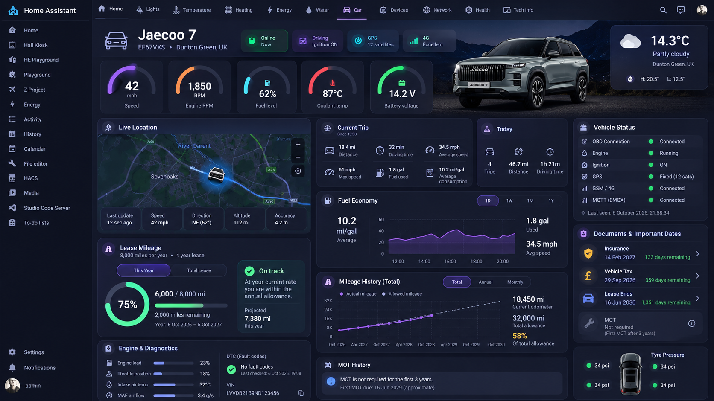

# Jaecoo OBD2 Home Assistant Dashboard Card

An advanced, high-performance modular dashboard card tailored for **Jaecoo 7** (and compatible Omoda/Chery vehicles) using real-time OBD2 telemetry and GPS data.

Built entirely with modern vanilla JavaScript and **Web Components (Shadow DOM)**, this card bypasses standard Lovelace layout constraints to deliver a sleek, automotive-cockpit experience with 0% CPU overhead—perfect for wall-mounted tablets and head units.


---

## 🗺️ Interface Prototype View

The card's structure replicates a multi-row modular layout specifically tailored to mimic a vehicle computer dashboard setup:



---

## ⚡ Key Features

* **Modular Architecture:** Clean separation of rows (`Header`, `Telemetry Grid`, `Interactive Map Views`, and `Diagnostics`) written as decoupled JavaScript classes.
* **Hardware-Accelerated UI:** Layout grids and visual states are calculated using pure CSS grids and optimized HTML layout boundaries, eliminating heavy runtime canvas scripting.
* **OBD2 Latency Smoothing:** Built-in transition dampening dynamically updates sensor nodes smoothly, absorbing tracking packet drops from Wi-Fi/Bluetooth OBD2 adapters (e.g., Torque, Traccar).
* **Isolated Styling Context:** Employs strict Shadow DOM encapsulation so custom dashboard layouts never leak or conflict with your global Home Assistant Lovelace themes.
* **Dynamic Styling Hooks:** Easily change dashboard accent hues dynamically via card level YAML parameter injections.

---

## 📂 Project Structure

The codebase is organized following clean architectural patterns for scalable Home Assistant frontend assets:

```text
jaecoo-obd2-ha-dashboard/
├── dist/                           # Production compiled files ready for deployment
│   └── jaecoo-obd2-card.js         # Unified plug-and-play plugin bundle for Home Assistant
│
├── src/                            # Modern ES6 module source workspace
│   ├── assets/                     # Local icons, silhouettes, and car outlines
│   ├── components/                 # Isolated UI custom elements inheriting BaseComponent
│   │   ├── BaseComponent.js        # Shared lifecycle scheduler and Shadow DOM initializer
│   │   ├── HeaderSection.js        # First row (Title, plate register, network nodes, clock)
│   │   ├── TelemetrySection.js     # Second row (Speed, RPM, Fuel, Coolant, and Weather blocks)
│   │   ├── MiddleRowSection.js     # Third row (Live Map viewport frame, trip logs, vehicle states)
│   │   └── AnalyticsSection.js     # Fourth row (Fuel economy analytics and mileage metrics charts)
│   ├── styles/                     # Raw modular CSS sheets compiled via Vite
│   │   ├── global.css              # Main flex framework grid layout
│   │   ├── header.css
│   │   ├── telemetry.css
│   │   ├── middle-row.css
│   │   └── analytics.css
│   ├── config-parser.js            # Input YAML schema validator and safety configuration block
│   └── main.js                     # Root plugin orchestrator bootstrapper
├── vite.config.js                  # Rollup/Vite layout asset management guidelines
└── package.json                    # Compilation scripts and development dependencies
```

---

## 🚀 Installation & Build

### 1. Build from Source
Compile your separate components and stylesheets into an optimized package using Node.js inside IntelliJ IDEA:

```bash
# Install core bundler environments
npm install

# Build the final modular script payload
npm run build
```
This generates your production plugin artifact inside `dist/jaecoo-obd2-card.js`.

### 2. Copy to Home Assistant
Move the file from your local `dist/` directory into your Home Assistant environment storage path:
```text
config/www/jaecoo-obd2-dashboard/
└── jaecoo-obd2-card.js
```
*(Make sure to put your `prototype.png` in the same directory if you intend to reference paths relatively on GitHub).*

### 3. Add Lovelace Dashboard Resource
Navigate to **Settings ➔ Dashboards ➔ Resources** inside the Home Assistant frontend and add a new module resource mapping:
* **URL:** `/local/jaecoo-obd2-dashboard/jaecoo-obd2-card.js`
* **Resource Type:** `JavaScript Module`

---

## 🖥️ Dashboard Layout Configuration (Crucial)

To prevent Home Assistant from squeezing this wide automotive interface into narrow columns, you **must** configure your Lovelace Dashboard view to run in **Panel Mode (Single Card)**. This forces the card to take up 100% of the screen width and height—perfect for tablets and car displays.

### UI Method:
1. Create a **New Dashboard** or add a **New View** inside your existing dashboard.
2. Edit the View properties (click the pencil icon next to the view tab).
3. Change the **View Type** from `Masonry (default)` to **Panel (1 card)**.
4. Add a **Manual Card** and paste the YAML configuration below.

---

## ⚙️ Configuration Properties

Add a **Manual Card** inside your dashboard layout grid view and map your tracking sensors:

### Configuration Options

| Key | Type | Required | Default | Description |
| :--- | :--- | :--- | :--- | :--- |
| `type` | `string` | **Yes** | `custom:jaecoo-obd2-card` | Unique identification mapping. |
| `title` | `string` | No | `Jaecoo 7` | Vehicle name title displayed on the header row. |
| `theme_color` | `string` | No | `#a855f7` | Hex value determining primary neon accent highlights. |
| `speed_unit` | `string` | No | `km/h` | String unit label placed beneath the main speed value. |
| `entities` | `object` | **Yes** | N/A | Root node mapping your HA sensor components. |

### Complete Entity Mapping Parameters (`entities:`)

| Key | Type | Required | Sample Source Integration | Description |
| :--- | :--- | :--- | :--- | :--- |
| `speed` | `string` | **Yes** | `sensor.car_speed` | Maps vehicle live speedometer output. |
| `rpm` | `string` | **Yes** | `sensor.engine_rpm` | Tracks engine revolution performance counters. |
| `fuel_level` | `string` | No | `sensor.fuel_remaining_percent` | Computes live liquid gas tanks capacities (0-100%). |
| `engine_temp` | `string` | No | `sensor.coolant_fluid_temp` | Monitors engine coolant heat readouts (°C). |
| `battery_voltage` | `string` | No | `sensor.alternator_volts` | Tracks live car battery tension states. |
| `odometer` | `string` | No | `sensor.total_mileage_run` | Pulls core absolute odometer indices (km/mi). |
| `outside_temp` | `string` | No | `sensor.ambient_air_temp` | Maps temperature markers to the weather tile. |
| `weather_condition` | `string` | No | `weather.home` | Feeds localized cloud descriptions to the UI. |
| `gps` | `string` | No | `device_tracker.jaecoo7_gps` | Feeds geographic coordinate points into the map block. |

---

## 📝 YAML Example Mapping

### Raw Dashboard YAML View Definition:
If you manage your dashboards in YAML code mode, ensure your view configuration contains `type: panel`:

```yaml
title: "Jaecoo Cockpit"
path: jaecoo_cockpit
type: panel # <--- Crucial setting for full-width scaling
cards:
  - type: custom:jaecoo-obd2-card
    title: "Jaecoo 7"
    theme_color: "#a855f7"
    speed_unit: "mph"
    entities:
      speed: sensor.jaecoo7_speed
      rpm: sensor.jaecoo7_rpm
      fuel_level: sensor.jaecoo7_fuel_level
      engine_temp: sensor.jaecoo7_coolant_temp
      battery_voltage: sensor.jaecoo7_battery_voltage
      odometer: sensor.jaecoo7_odometer
      outside_temp: sensor.jaecoo7_outside_temperature
      weather_condition: weather.home
      gps: device_tracker.jaecoo7_gps
```

---

## 🛡️ License
Distributed under the **MIT License**. See `LICENSE` for more information.
